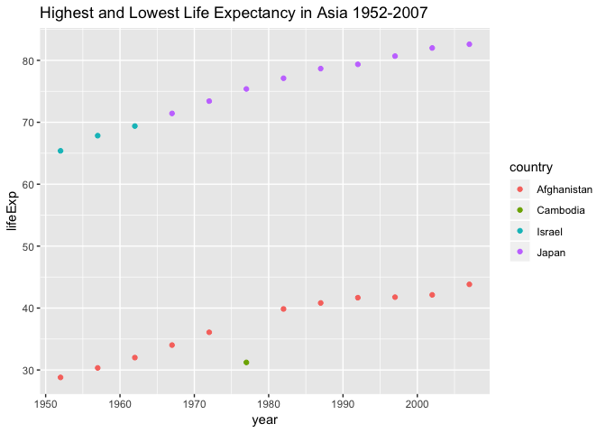

hw04\_couBC
================
CouBC
2018-10-07

-   [Task 1 - Data Re-Shaping](#task-1---data-re-shaping)
    -   [I use the same specified tibble](#i-use-the-same-specified-tibble)
    -   [This plot shows the highest and lowest life expectancy Asian countries between 1952-2007](#this-plot-shows-the-highest-and-lowest-life-expectancy-asian-countries-between-1952-2007)
-   [Task 2:](#task-2)
    -   [left\_join(places\_visited, airports)](#left_joinplaces_visited-airports)
    -   [left\_join(airports, places\_visited)](#left_joinairports-places_visited)
    -   [right\_join(places\_visited, airports)](#right_joinplaces_visited-airports)
    -   [right\_join(airports, places\_visited)](#right_joinairports-places_visited)
    -   [inner\_join(places\_visited, airports)](#inner_joinplaces_visited-airports)
    -   [inner\_join(airports, places\_visited)](#inner_joinairports-places_visited)
    -   [semi\_join(places\_visited, airports)](#semi_joinplaces_visited-airports)
    -   [semi\_join(airports, places\_visited)](#semi_joinairports-places_visited)
    -   [full\_join(places\_visited, airports)](#full_joinplaces_visited-airports)
    -   [full\_join(airports, places\_visited)](#full_joinairports-places_visited)
    -   [anti\_join(places\_visited, airports)](#anti_joinplaces_visited-airports)
    -   [anti\_join(airports, places\_visited)](#anti_joinairports-places_visited)

Task 1 - Data Re-Shaping
========================

In Window functions, we formed a tibble with 24 rows: 2 per year, giving the country with both the lowest and highest life expectancy (in Asia). Take that table (or a similar one for all continents) and reshape it so you have one row per year.

First, I load gapminder and tidyverse.

``` r
suppressPackageStartupMessages(library(tidyverse))
suppressPackageStartupMessages(library(gapminder))
```

I use the same specified tibble
-------------------------------

``` r
Asia_lifeExp <- gapminder %>%
  filter(continent == "Asia") %>%
  select(year, country, lifeExp) %>%
  group_by(year) %>%
  filter(min_rank(desc(lifeExp)) < 2 | min_rank(lifeExp) < 2) %>% 
  arrange(year) %>%
  print(n = Inf)
```

    ## # A tibble: 24 x 3
    ## # Groups:   year [12]
    ##     year country     lifeExp
    ##    <int> <fct>         <dbl>
    ##  1  1952 Afghanistan    28.8
    ##  2  1952 Israel         65.4
    ##  3  1957 Afghanistan    30.3
    ##  4  1957 Israel         67.8
    ##  5  1962 Afghanistan    32.0
    ##  6  1962 Israel         69.4
    ##  7  1967 Afghanistan    34.0
    ##  8  1967 Japan          71.4
    ##  9  1972 Afghanistan    36.1
    ## 10  1972 Japan          73.4
    ## 11  1977 Cambodia       31.2
    ## 12  1977 Japan          75.4
    ## 13  1982 Afghanistan    39.9
    ## 14  1982 Japan          77.1
    ## 15  1987 Afghanistan    40.8
    ## 16  1987 Japan          78.7
    ## 17  1992 Afghanistan    41.7
    ## 18  1992 Japan          79.4
    ## 19  1997 Afghanistan    41.8
    ## 20  1997 Japan          80.7
    ## 21  2002 Afghanistan    42.1
    ## 22  2002 Japan          82  
    ## 23  2007 Afghanistan    43.8
    ## 24  2007 Japan          82.6

I spread the data so that each year (row data) only appears once. This is untidy because it breaks the rules of tidy data which are 1) each variable must have its own column, 2) each observation must have its own row, and 3) eacj value must have its own cell (R4DS). In this case, country as a variable is now spread over 4 columns.

``` r
Asia_untidy <- Asia_lifeExp %>% 
  spread(key = country, value = lifeExp)
Asia_untidy
```

    ## # A tibble: 12 x 5
    ## # Groups:   year [12]
    ##     year Afghanistan Cambodia Israel Japan
    ##    <int>       <dbl>    <dbl>  <dbl> <dbl>
    ##  1  1952        28.8     NA     65.4  NA  
    ##  2  1957        30.3     NA     67.8  NA  
    ##  3  1962        32.0     NA     69.4  NA  
    ##  4  1967        34.0     NA     NA    71.4
    ##  5  1972        36.1     NA     NA    73.4
    ##  6  1977        NA       31.2   NA    75.4
    ##  7  1982        39.9     NA     NA    77.1
    ##  8  1987        40.8     NA     NA    78.7
    ##  9  1992        41.7     NA     NA    79.4
    ## 10  1997        41.8     NA     NA    80.7
    ## 11  2002        42.1     NA     NA    82  
    ## 12  2007        43.8     NA     NA    82.6

This plot shows the highest and lowest life expectancy Asian countries between 1952-2007
----------------------------------------------------------------------------------------

``` r
Asia_lifeExp %>% 
  ggplot(aes(x = year, y = lifeExp, color = country)) +
  geom_point() +
  ggtitle("Highest and Lowest Life Expectancy in Asia 1952-2007")
```



Task 2:
=======

Create your own cheatsheet patterned after Jenny’s but focused on something you care about more than comics.

You will likely need to iterate between your data prep and your joining to make your explorations comprehensive and interesting. For example, you will want a specific amount (or lack) of overlap between the two data.frames, in order to demonstrate all the different joins. You will want both the data frames to be as small as possible, while still retaining the expository value

I created two tables - one of a few places I've visited, and one of a few airports I've flown to/through, with significance but not complete overlap between the two tables.

``` r
places_visited <- "
city, country, beach
  Tokyo, Japan, no
  Dubai, United Arab Emirates, yes
  Istanbul, Turkey, yes
  Rome, Italy, no
  San Antonio, United States, no
  Merida, Mexico, no
"

places_visited <- read_csv(places_visited, skip = 1)
places_visited
```

    ## # A tibble: 6 x 3
    ##   city        country              beach
    ##   <chr>       <chr>                <chr>
    ## 1 Tokyo       Japan                no   
    ## 2 Dubai       United Arab Emirates yes  
    ## 3 Istanbul    Turkey               yes  
    ## 4 Rome        Italy                no   
    ## 5 San Antonio United States        no   
    ## 6 Merida      Mexico               no

``` r
airports <- "
airports, country, airport_quality
  Narita, Japan, 4
  Dubai, United Arab Emirates, 6
  Ataturk, Turkey, 2
  Leonardo da Vinci, Italy, 3
  San Antonio, United States, 1
  Schiphol, Netherlands, 5
"
airports <- read_csv(airports, skip = 1)
airports
```

    ## # A tibble: 6 x 3
    ##   airports          country              airport_quality
    ##   <chr>             <chr>                          <int>
    ## 1 Narita            Japan                              4
    ## 2 Dubai             United Arab Emirates               6
    ## 3 Ataturk           Turkey                             2
    ## 4 Leonardo da Vinci Italy                              3
    ## 5 San Antonio       United States                      1
    ## 6 Schiphol          Netherlands                        5

left\_join(places\_visited, airports)
-------------------------------------

With left join places\_visited then airports, I am missing Schiphol airport (Netherlands) from the airports table. This left\_join is matched by 'country'.

``` r
left_join(places_visited, airports) %>% 
  knitr::kable()
```

    ## Joining, by = "country"

| city        | country              | beach | airports          |  airport\_quality|
|:------------|:---------------------|:------|:------------------|-----------------:|
| Tokyo       | Japan                | no    | Narita            |                 4|
| Dubai       | United Arab Emirates | yes   | Dubai             |                 6|
| Istanbul    | Turkey               | yes   | Ataturk           |                 2|
| Rome        | Italy                | no    | Leonardo da Vinci |                 3|
| San Antonio | United States        | no    | San Antonio       |                 1|
| Merida      | Mexico               | no    | NA                |                NA|

left\_join(airports, places\_visited)
-------------------------------------

With left\_join airport first, I retain Schiphol Airport (Netherlands) but lose Merida, Mexico as a place visited. Interpretation wise, this is an accurate depiction of my travel history as I've been to Schiphol airport but never been to Amsterdam.

``` r
left_join(airports, places_visited) %>% 
knitr::kable()
```

    ## Joining, by = "country"

| airports          | country              |  airport\_quality| city        | beach |
|:------------------|:---------------------|-----------------:|:------------|:------|
| Narita            | Japan                |                 4| Tokyo       | no    |
| Dubai             | United Arab Emirates |                 6| Dubai       | yes   |
| Ataturk           | Turkey               |                 2| Istanbul    | yes   |
| Leonardo da Vinci | Italy                |                 3| Rome        | no    |
| San Antonio       | United States        |                 1| San Antonio | no    |
| Schiphol          | Netherlands          |                 5| NA          | NA    |

right\_join(places\_visited, airports)
--------------------------------------

Similar to left\_join, I lose a bit of information. In Right\_join(places\_visited, airports) I lose out on visiting Merida, Mexico because I did not fly there.

``` r
right_join(places_visited, airports) %>% 
knitr::kable()
```

    ## Joining, by = "country"

| city        | country              | beach | airports          |  airport\_quality|
|:------------|:---------------------|:------|:------------------|-----------------:|
| Tokyo       | Japan                | no    | Narita            |                 4|
| Dubai       | United Arab Emirates | yes   | Dubai             |                 6|
| Istanbul    | Turkey               | yes   | Ataturk           |                 2|
| Rome        | Italy                | no    | Leonardo da Vinci |                 3|
| San Antonio | United States        | no    | San Antonio       |                 1|
| NA          | Netherlands          | NA    | Schiphol          |                 5|

right\_join(airports, places\_visited)
--------------------------------------

Here it depicts that I've been to Merida, Mexico but gives no quality of rating of airport. Right\_join(airports, places\_visited) is identical to left\_join(places\_visited, airports)

``` r
right_join(airports, places_visited)  %>% 
  knitr::kable()
```

    ## Joining, by = "country"

| airports          | country              |  airport\_quality| city        | beach |
|:------------------|:---------------------|-----------------:|:------------|:------|
| Narita            | Japan                |                 4| Tokyo       | no    |
| Dubai             | United Arab Emirates |                 6| Dubai       | yes   |
| Ataturk           | Turkey               |                 2| Istanbul    | yes   |
| Leonardo da Vinci | Italy                |                 3| Rome        | no    |
| San Antonio       | United States        |                 1| San Antonio | no    |
| NA                | Mexico               |                NA| Merida      | no    |

inner\_join(places\_visited, airports)
--------------------------------------

Inner\_join retains only rows in both sets. Here I miss out on Merida and Schiphol Airport

``` r
inner_join(places_visited, airports) %>% 
knitr::kable()
```

    ## Joining, by = "country"

| city        | country              | beach | airports          |  airport\_quality|
|:------------|:---------------------|:------|:------------------|-----------------:|
| Tokyo       | Japan                | no    | Narita            |                 4|
| Dubai       | United Arab Emirates | yes   | Dubai             |                 6|
| Istanbul    | Turkey               | yes   | Ataturk           |                 2|
| Rome        | Italy                | no    | Leonardo da Vinci |                 3|
| San Antonio | United States        | no    | San Antonio       |                 1|

inner\_join(airports, places\_visited)
--------------------------------------

Similarly, I miss out on Merida and Schiphol Airport

``` r
inner_join(airports, places_visited) %>% 
knitr::kable()
```

    ## Joining, by = "country"

| airports          | country              |  airport\_quality| city        | beach |
|:------------------|:---------------------|-----------------:|:------------|:------|
| Narita            | Japan                |                 4| Tokyo       | no    |
| Dubai             | United Arab Emirates |                 6| Dubai       | yes   |
| Ataturk           | Turkey               |                 2| Istanbul    | yes   |
| Leonardo da Vinci | Italy                |                 3| Rome        | no    |
| San Antonio       | United States        |                 1| San Antonio | no    |

semi\_join(places\_visited, airports)
-------------------------------------

in semi-join - only rows that have a match in places\_visited and airports are retained, losing columns re: airport and airport quality

``` r
semi_join(places_visited, airports) %>% 
knitr::kable()
```

    ## Joining, by = "country"

| city        | country              | beach |
|:------------|:---------------------|:------|
| Tokyo       | Japan                | no    |
| Dubai       | United Arab Emirates | yes   |
| Istanbul    | Turkey               | yes   |
| Rome        | Italy                | no    |
| San Antonio | United States        | no    |

semi\_join(airports, places\_visited)
-------------------------------------

Here I lose out on city and beach columns.

``` r
semi_join(airports, places_visited) %>% 
  knitr::kable()
```

    ## Joining, by = "country"

| airports          | country              |  airport\_quality|
|:------------------|:---------------------|-----------------:|
| Narita            | Japan                |                 4|
| Dubai             | United Arab Emirates |                 6|
| Ataturk           | Turkey               |                 2|
| Leonardo da Vinci | Italy                |                 3|
| San Antonio       | United States        |                 1|

full\_join(places\_visited, airports)
-------------------------------------

full\_join lets me retain the data from all rows and all values

``` r
full_join(places_visited, airports) %>% 
knitr::kable()
```

    ## Joining, by = "country"

| city        | country              | beach | airports          |  airport\_quality|
|:------------|:---------------------|:------|:------------------|-----------------:|
| Tokyo       | Japan                | no    | Narita            |                 4|
| Dubai       | United Arab Emirates | yes   | Dubai             |                 6|
| Istanbul    | Turkey               | yes   | Ataturk           |                 2|
| Rome        | Italy                | no    | Leonardo da Vinci |                 3|
| San Antonio | United States        | no    | San Antonio       |                 1|
| Merida      | Mexico               | no    | NA                |                NA|
| NA          | Netherlands          | NA    | Schiphol          |                 5|

full\_join(airports, places\_visited)
-------------------------------------

similar to previous full-join with airport table data displayed first, retains all available rows and values

``` r
full_join(airports, places_visited) %>% 
  knitr::kable()
```

    ## Joining, by = "country"

| airports          | country              |  airport\_quality| city        | beach |
|:------------------|:---------------------|-----------------:|:------------|:------|
| Narita            | Japan                |                 4| Tokyo       | no    |
| Dubai             | United Arab Emirates |                 6| Dubai       | yes   |
| Ataturk           | Turkey               |                 2| Istanbul    | yes   |
| Leonardo da Vinci | Italy                |                 3| Rome        | no    |
| San Antonio       | United States        |                 1| San Antonio | no    |
| Schiphol          | Netherlands          |                 5| NA          | NA    |
| NA                | Mexico               |                NA| Merida      | no    |

anti\_join(places\_visited, airports)
-------------------------------------

Anti\_join only retains the rows that do not have a match in airports, in which case, this is Merida. I hypothesize that anti\_join with airports first will produce Schiphol

``` r
anti_join(places_visited, airports) %>% 
  knitr::kable()
```

    ## Joining, by = "country"

| city   | country | beach |
|:-------|:--------|:------|
| Merida | Mexico  | no    |

anti\_join(airports, places\_visited)
-------------------------------------

anti\_join can be useful to identify/extricate non-matching rows between tables

``` r
anti_join(airports, places_visited) %>% 
  knitr::kable()
```

    ## Joining, by = "country"

| airports | country     |  airport\_quality|
|:---------|:------------|-----------------:|
| Schiphol | Netherlands |                 5|
